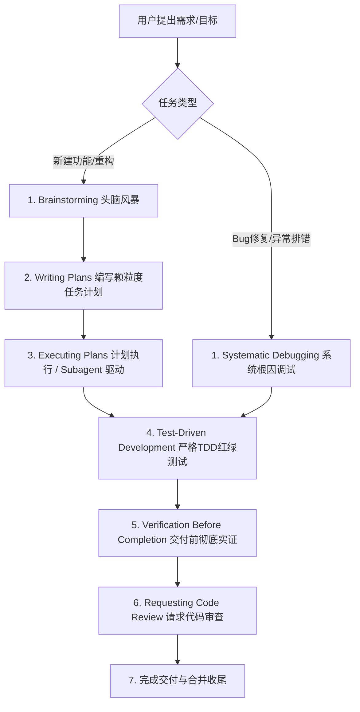

# Superpowers Agentic Workflow Specification (工作流工程规范)

本项目已正式接入 **Superpowers** 敏捷工程方法论与技能体系。在处理本项目的任何工程、架构、编码、调试与重构任务时，Agent 必须强制激活并依序执行以下标准工作流。

---

## 1. 核心工作流流水线 (The Pipeline)

遇到复杂或多步骤任务时，严禁跳过流程直接写代码。必须按如下流水线推进：

---

## 2. 阶段工作流详解与技能调度

### 阶段一：头脑风暴与需求澄清 (`superpowers:brainstorming`)
- **触发时机**：当用户提出“构建 X”、“重构 Y”或需求存在模糊空间时。
- **执行准则**：
  1. 绝不立刻动手写代码，先退后一步向用户提问，挖掘背后的真实意图与边界约束。
  2. 简明呈现设计要点（Architecture Specs），每次仅输出易于消化理解的小篇幅内容。
  3. 待用户明确确认设计方案后，方可进入下一阶段。

### 阶段二：实施规划与分解 (`superpowers:writing-plans`)
- **触发时机**：方案设计获批后，准备开始编码前。
- **执行准则**：
  1. 将大任务拆解为颗粒度精确到单个文件、单个函数修改的步骤。
  2. 每一项任务必须配备明确的**可检验验证手段（Verification Command/Steps）**。
  3. 遵循 YAGNI（不写不需要的代码）与 DRY（绝不重复代码）原则。

### 阶段三：执行与测试驱动开发 (`superpowers:executing-plans` & `test-driven-development`)
- **触发时机**：实施计划确认后。
- **执行准则**：
  1. **TDD 红绿重构循环**：
     - **Red**：先编写针对新功能的失败测试用例，运行确认其因缺少实现而失败；
     - **Green**：编写刚刚好能让测试通过的极简实现代码；
     - **Refactor**：在测试保护网下重构与提炼代码，杜绝冗余。
  2. **任务清单追踪 (Task Tracking)**：
     - 在 Antigravity 中，严格使用 **Task Artifact** 维护待办清单（`- [ ]`）。
     - 每完成一步立即更新为 `- [x]`，确保上下文超长时长仍有唯一的真实进度信标。

### 阶段四：系统性排错调试 (`superpowers:systematic-debugging`)
- **触发时机**：当遇到测试失败、运行报错或异常行为时。
- **执行准则**：
  1. **禁止盲猜试错**：必须通过日志、堆栈跟踪与断点排查找到根本原因（Root Cause）。
  2. **编写复现用例**：在修改任何生产代码前，先写出能 100% 稳定复现 Bug 的最小测试脚本。
  3. **最小化修复**：只修改造成问题的根本代码，验证测试由红变绿，绝不捎带修改不相关逻辑。

### 阶段五：交付前最终验证 (`superpowers:verification-before-completion`)
- **触发时机**：准备宣布任务完成或向用户提交成果前。
- **执行准则**：
  1. **绝不凭空宣称完成**：必须在终端或测试套件中实际运行全量验证命令，获取真实的 exit code 0 与测试报告。
  2. 自行运行构建验证（如 `python build.py`），确保编译与静态分析零警告零报错。

---

## 3. Antigravity 平台工具适配映射

| Superpowers 抽象动作 | Antigravity IDE / CLI 对应落地工具 |
| :--- | :--- |
| **创建/维护任务清单 (Create Todo)** | 创建并维护 **Task Artifact** (`write_to_file` 配合 `ArtifactMetadata.ArtifactType: "task"`)，通过 `replace_file_content` 动态打勾更新。 |
| **分发独立子任务 (Dispatch Subagent)** | 调用 `invoke_subagent` 或 `browser_subagent`，为子任务隔离上下文。 |
| **阅读技能指令** | 使用 `view_file` 阅读 `.agents/skills/<skill-name>/SKILL.md`。 |

---

## 4. 冲突解决优先级 (Precedence)

1. **用户直接指令**（包括全局 User Rules / Prompt 要求）具有最高优先级；
2. **Superpowers 工作流守则** 次之；
3. **Agent 默认无拘束直觉行为** 最低。
